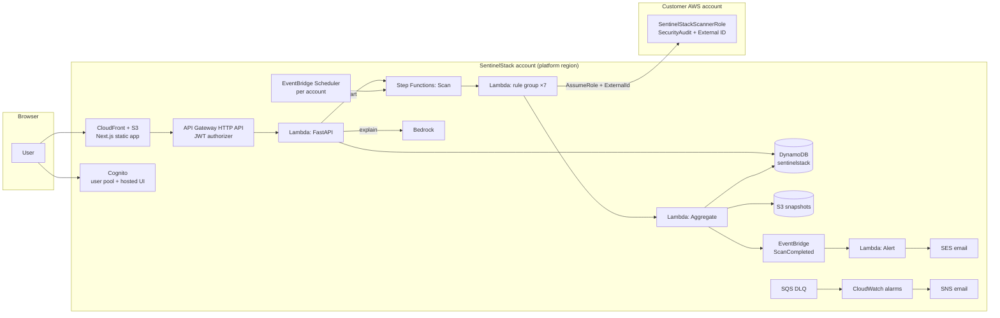

# Architecture

Owner: Track C · Status: **first draft (Week 1)** — updated with the real state machine in Week 2 and the
final diagram in Week 4.

## The five flows

1. **User** — Browser → CloudFront + S3 (Next.js static export) → sign-in with Cognito hosted UI
   (authorization code + PKCE) → API Gateway HTTP API (JWT check on the ID token) → Lambda (FastAPI via
   Mangum) → DynamoDB. Org isolation comes from the token's `custom:org_id`.
2. **Scan** — EventBridge Scheduler (every 12 h, one schedule per account) or `POST /accounts/{id}/scans`
   → Step Functions "Scan" → Map over 7 rule groups (s3, iam, ec2, ebs, cloudtrail, kms, lambda), each a
   Lambda that assumes the customer role with the External ID and runs its rules → Lambda "Aggregate"
   (deterministic finding keys, new/resolved diff, score) → DynamoDB findings + scan record, S3 snapshot
   JSON → EventBridge event `ScanCompleted`. Only account ID and scan ID pass through the Map state.
3. **Alert** — `ScanCompleted` → Lambda "Alert" → if `new > 0`, SES email to the org's recipients.
4. **Explain** — user clicks Explain → `POST /findings/{id}/explain` → Bedrock (rule metadata + evidence;
   resource names treated as untrusted data) → explanation + fix draft cached on the finding.
5. **Operate** — any failure → SQS dead-letter queue → CloudWatch alarm → SNS email. All Lambdas write
   structured JSON logs; CloudWatch dashboard; CloudTrail on our own account. GitHub Actions → CDK deploy
   dev → CI scan test on the insecure stack → manual approval → CDK deploy prod.

## Trust boundary (customer side)

The onboarding template creates exactly one IAM role, `SentinelStackScannerRole`:

- **Permissions:** AWS-managed `SecurityAudit` (read-only).
- **Trust:** only SentinelStack's scanner Lambda role ARN, and only with `StringEquals sts:ExternalId`.
- **Session:** at most 1 hour.

Nothing else is created in the customer account, and nothing there can be modified.

## Frontend

- Next.js App Router, `output: "export"` — every route is a static HTML page; all data is fetched in the
  browser with the user's token. No server runtime, so hosting is just S3 + CloudFront with Origin Access
  Control.
- `src/lib/api.ts` is the single API client; in demo mode (no API URL configured) it is backed by
  `src/lib/mock.ts`, which mirrors the insecure target stack.
- Untrusted strings from customer accounts (resource names, tags, evidence) are only ever rendered as text.

## Infrastructure (CDK, Python) — 5 stacks

| Stack | Contains |
|---|---|
| core | DynamoDB table + GSIs, KMS key, snapshot bucket, Cognito user pool / client / groups |
| api | HTTP API + JWT authorizer, FastAPI Lambda |
| scanner | Step Functions, rule-group / aggregate / alert Lambdas, Scheduler, DLQ, EventBridge |
| web | S3 bucket + CloudFront (OAC), later Route 53 + ACM |
| observability | CloudWatch dashboard, 5 alarms, SNS topic |

## Regions

- **Platform region:** e.g. `ap-south-1` — everything above.
- **Target region:** e.g. `us-east-1` — `target-insecure.yaml`, `target-secure.yaml`, onboarding role test.
  (ACM certificates for CloudFront must also be in `us-east-1`.)
